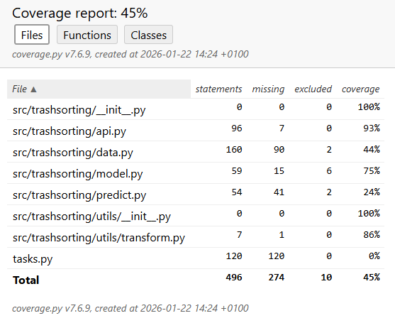
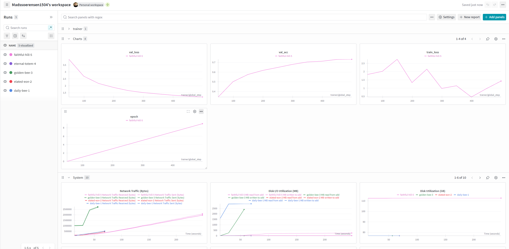
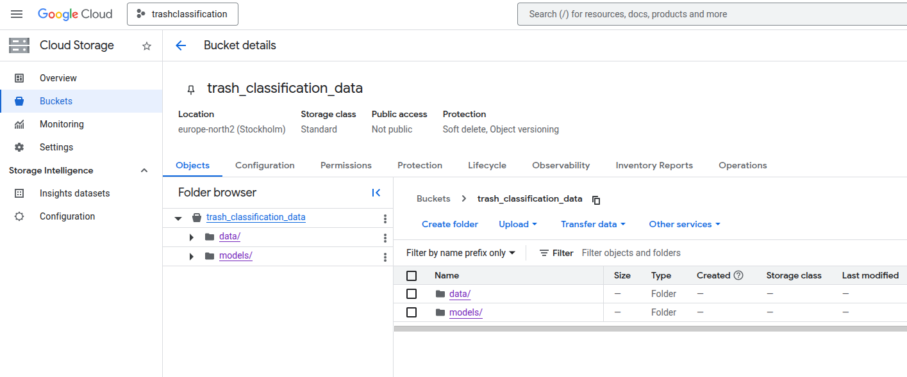
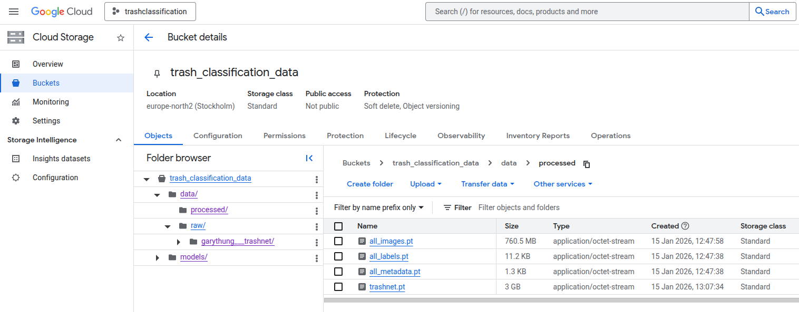
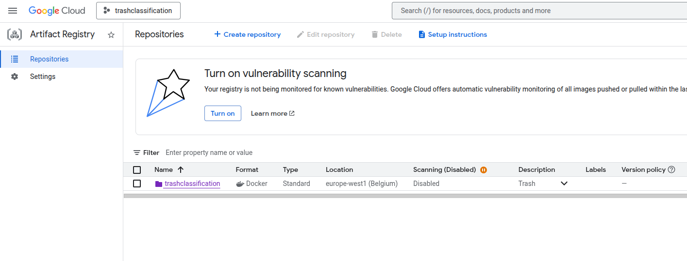
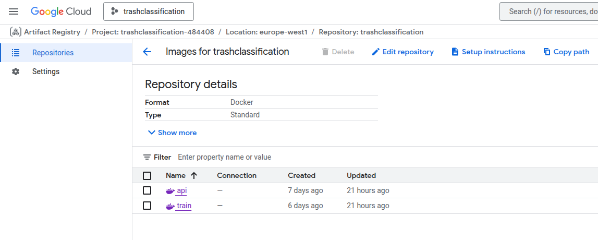
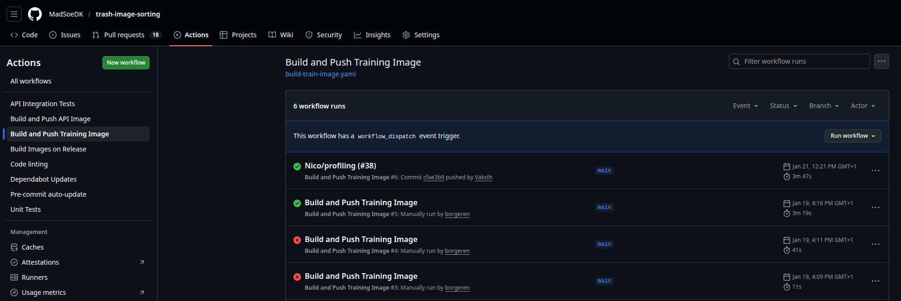
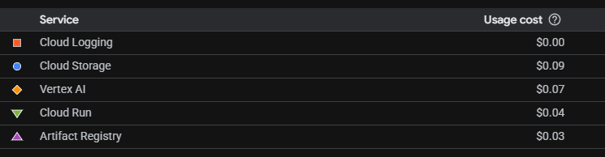
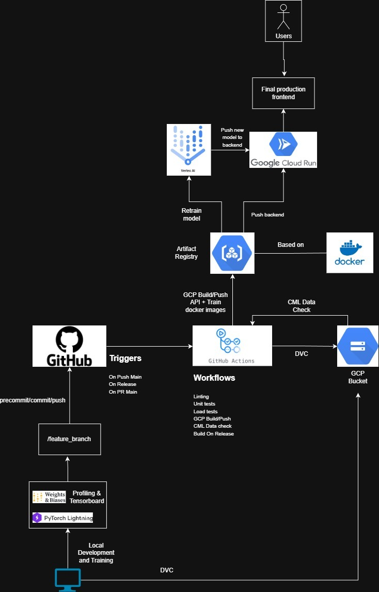

# Exam template for 02476 Machine Learning Operations

This is the report template for the exam. Please only remove the text formatted as with three dashes in front and behind
like:

```--- question 1 fill here ---```

Where you instead should add your answers. Any other changes may have unwanted consequences when your report is
auto-generated at the end of the course. For questions where you are asked to include images, start by adding the image
to the `figures` subfolder (please only use `.png`, `.jpg` or `.jpeg`) and then add the following code in your answer:

``

In addition to this markdown file, we also provide the `report.py` script that provides two utility functions:

Running:

```bash
python report.py html
```

Will generate a `.html` page of your report. After the deadline for answering this template, we will auto-scrape
everything in this `reports` folder and then use this utility to generate a `.html` page that will be your serve
as your final hand-in.

Running

```bash
python report.py check
```

Will check your answers in this template against the constraints listed for each question e.g. is your answer too
short, too long, or have you included an image when asked. For both functions to work you mustn't rename anything.
The script has two dependencies that can be installed with

```bash
pip install typer markdown
```

or

```bash
uv add typer markdown
```

## Overall project checklist

The checklist is *exhaustive* which means that it includes everything that you could do on the project included in the
curriculum in this course. Therefore, we do not expect at all that you have checked all boxes at the end of the project.
The parenthesis at the end indicates what module the bullet point is related to. Please be honest in your answers, we
will check the repositories and the code to verify your answers.

### Week 1

* [x] Create a git repository (M5)
* [x] Make sure that all team members have write access to the GitHub repository (M5)
* [x] Create a dedicated environment for you project to keep track of your packages (M2)
* [x] Create the initial file structure using cookiecutter with an appropriate template (M6)
* [x] Fill out the `data.py` file such that it downloads whatever data you need and preprocesses it (if necessary) (M6)
* [x] Add a model to `model.py` and a training procedure to `train.py` and get that running (M6)
* [ ] Remember to fill out the `requirements.txt` and `requirements_dev.txt` file with whatever dependencies that you
    are using (M2+M6)
* [x] Remember to comply with good coding practices (`pep8`) while doing the project (M7)
* [x] Do a bit of code typing and remember to document essential parts of your code (M7)
* [x] Setup version control for your data or part of your data (M8)
* [x] Add command line interfaces and project commands to your code where it makes sense (M9)
* [x] Construct one or multiple docker files for your code (M10)
* [x] Build the docker files locally and make sure they work as intended (M10)
* [x] Write one or multiple configurations files for your experiments (M11)
* [x] Used Hydra to load the configurations and manage your hyperparameters (M11)
* [x] Use profiling to optimize your code (M12)
* [x] Use logging to log important events in your code (M14)
* [x] Use Weights & Biases to log training progress and other important metrics/artifacts in your code (M14)
* [ ] Consider running a hyperparameter optimization sweep (M14)
* [x] Use PyTorch-lightning (if applicable) to reduce the amount of boilerplate in your code (M15)

### Week 2

* [x] Write unit tests related to the data part of your code (M16)
* [x] Write unit tests related to model construction and or model training (M16)
* [x] Calculate the code coverage (M16)
* [x] Get some continuous integration running on the GitHub repository (M17)
* [ ] Add caching and multi-os/python/pytorch testing to your continuous integration (M17)
* [x] Add a linting step to your continuous integration (M17)
* [x] Add pre-commit hooks to your version control setup (M18)
* [x] Add a continues workflow that triggers when data changes (M19)
* [ ] Add a continues workflow that triggers when changes to the model registry is made (M19)
* [x] Create a data storage in GCP Bucket for your data and link this with your data version control setup (M21)
* [x] Create a trigger workflow for automatically building your docker images (M21)
* [x] Get your model training in GCP using either the Engine or Vertex AI (M21)
* [x] Create a FastAPI application that can do inference using your model (M22)
* [x] Deploy your model in GCP using either Functions or Run as the backend (M23)
* [x] Write API tests for your application and setup continues integration for these (M24)
* [x] Load test your application (M24)
* [ ] Create a more specialized ML-deployment API using either ONNX or BentoML, or both (M25)
* [x] Create a frontend for your API (M26)

### Week 3

* [ ] Check how robust your model is towards data drifting (M27)
* [ ] Deploy to the cloud a drift detection API (M27)
* [ ] Instrument your API with a couple of system metrics (M28)
* [ ] Setup cloud monitoring of your instrumented application (M28)
* [ ] Create one or more alert systems in GCP to alert you if your app is not behaving correctly (M28)
* [ ] If applicable, optimize the performance of your data loading using distributed data loading (M29)
* [ ] If applicable, optimize the performance of your training pipeline by using distributed training (M30)
* [ ] Play around with quantization, compilation and pruning for you trained models to increase inference speed (M31)

### Extra

* [ ] Write some documentation for your application (M32)
* [ ] Publish the documentation to GitHub Pages (M32)
* [x] Revisit your initial project description. Did the project turn out as you wanted?
* [ ] Create an architectural diagram over your MLOps pipeline
* [x] Make sure all group members have an understanding about all parts of the project
* [x] Uploaded all your code to GitHub

## Group information

### Question 1
> **Enter the group number you signed up on <learn.inside.dtu.dk>**
>
> Answer:

13

### Question 2
> **Enter the study number for each member in the group**
>
> Example:
>
> *sXXXXXX, sXXXXXX, sXXXXXX*
>
> Answer:

s215805, s260399, s214964, s234855

### Question 3
> **A requirement to the project is that you include a third-party package not covered in the course. What framework**
> **did you choose to work with and did it help you complete the project?**
>
> Recommended answer length: 100-200 words.
>
> Example:
> *We used the third-party framework ... in our project. We used functionality ... and functionality ... from the*
> *package to do ... and ... in our project*.
>
> Answer:

We used the third‑party framework timm (PyTorch Image Models),
which is a collection of many pretrained image models, as a
core component of our project. We used timm.create_model()
to load a pretrained convolutional network (in our case, a
MobileNetV3 variant "mobilenetv3_small_100"), which served
as the backbone of our image‑classification pipeline. Using
a pretrained model allowed us to leverage modern architectures
and transfer learning with minimal effort. With timm we can
quickly load a model, fine tune it on our own data and use it
to make predictions.
Without timm, we would have had to manually implement the
entire model or import less‑well‑tested model definitions. Timm
significantly reduced boilerplate code and allowed us to focus
more on the training pipeline and evaluation rather than
low‑level model engineering.

## Coding environment

> In the following section we are interested in learning more about you local development environment. This includes
> how you managed dependencies, the structure of your code and how you managed code quality.

### Question 4

> **Explain how you managed dependencies in your project? Explain the process a new team member would have to go**
> **through to get an exact copy of your environment.**
>
> Recommended answer length: 100-200 words
>
> Example:
> *We used ... for managing our dependencies. The list of dependencies was auto-generated using ... . To get a*
> *complete copy of our development environment, one would have to run the following commands*
>
> Answer:

We used `uv` for managing our dependencies, which are all listed in the `pyproject.toml` file. This includes both production dependencies like PyTorch, FastAPI, and Hydra, as well as development tools like pytest and ruff in a separate dev group. To set up an identical environment, a new team member would need to install `uv` first, then run `uv sync` in the project root. This reads the lock file and installs all dependencies with exact versions. We also provide a devcontainer configuration that sets up the complete development environment automatically in VS Code. Lastly, for data, we use DVC to download the datasets from a Google Cloud Platform(GCP) bucket.

### Question 5

> **We expect that you initialized your project using the cookiecutter template. Explain the overall structure of your**
> **code. What did you fill out? Did you deviate from the template in some way?**
>
> Recommended answer length: 100-200 words
>
> Example:
> *From the cookiecutter template we have filled out the ... , ... and ... folder. We have removed the ... folder*
> *because we did not use any ... in our project. We have added an ... folder that contains ... for running our*
> *experiments.*
>
> Answer:

We started with the cookiecutter MLOps template and filled out the core folders like `src/trashsorting`, `configs`, `tests`, and `data`. The main module includes `data.py` for loading our trash dataset, `model.py` for defining the model architecture, `train.py` for training, and `api.py` for the FastAPI endpoints. The root `model` contains the output from the training phase with model weights etc. We used the `dockerfiles` folder with separate dockerfiles for training and API deployment. We also created a `static` folder inside the core module for frontend files and used the `notebooks` folder for exploratory analysis and demos. We removed the `visualize.py` file since we ended up doing most visualization in notebooks instead. Overall we followed the template structure closely.

### Question 6

> **Did you implement any rules for code quality and format? What about typing and documentation? Additionally,**
> **explain with your own words why these concepts matters in larger projects.**
>
> Recommended answer length: 100-200 words.
>
> Example:
> *We used ... for linting and ... for formatting. We also used ... for typing and ... for documentation. These*
> *concepts are important in larger projects because ... . For example, typing ...*
>
> Answer:

We used Ruff for both linting and formatting. We added type hints throughout our code using Python's typing module. Pre-commit hooks helped us catch issues before they get committed, things like trailing whitespace, broken YAML files, and large files. These practices matter a lot in team projects because they keep the codebase consistent and readable. Type hints especially help catch bugs early and make it easier to understand what functions expect as inputs. When multiple people are working on the same code, having automated formatting means you don't waste time arguing about style or reviewing formatting changes.

## Version control

> In the following section we are interested in how version control was used in your project during development to
> corporate and increase the quality of your code.

### Question 7

> **How many tests did you implement and what are they testing in your code?**
>
> Recommended answer length: 50-100 words.
>
> Example:
> *In total we have implemented X tests. Primarily we are testing ... and ... as these the most critical parts of our*
> *application but also ... .*
>
> Answer:

In total we have implemented 17 unit tests primarily testing the most critical parts being *data*, *model* and *training*. We also tested the API client to validate endpoints, prediction behaviour, errors and model info. The data.py tests check for dataset instantiation, input shape, and several tests for the train/test split. The model.py tests are separated into tests regarding model initialization and model training. Initialization tests checks model instantiation and that the pretrained weights are frozen, while training tests check a loss is calculated and gradients are changed.


### Question 8

> **What is the total code coverage (in percentage) of your code? If your code had a code coverage of 100% (or close**
> **to), would you still trust it to be error free? Explain you reasoning.**
>
> Recommended answer length: 100-200 words.
>
> Example:
> *The total code coverage of code is X%, which includes all our source code. We are far from 100% coverage of our **
> *code and even if we were then...*
>
> Answer:

The total code coverage is 52% of the source code. It's far from 100% coverage, with varying coverage by module (see image below). A coverage of less than 100% is expected as fx model.py has code that only runs in a PyTorch Lightning Trainer and is therefore intentionally not run in our isolated unit tests, where we assume the developers of the library have tested their code extensively themselves. The same is true for logger statements in the data.py tests. Achieving close to 100% coverage would require very extensive tests, which might provide little additional value. Even with perfect coverage, we still couldn’t assume the code is error‑free, as coverage only measures if lines are run, and not whether they behave correctly. 




### Question 9

> **Did you workflow include using branches and pull requests? If yes, explain how. If not, explain how branches and**
> **pull request can help improve version control.**
>
> Recommended answer length: 100-200 words.
>
> Example:
> *We made use of both branches and PRs in our project. In our group, each member had an branch that they worked on in*
> *addition to the main branch. To merge code we ...*
>
> Answer:

We used branches and pull requests throughout the project. Each team member typically worked on their own feature branches with names like `mads/frontend-app`, `vhy/dvc-google-cloud-storage`, or `data-loading` for specific features. When a feature was ready, we'd open a pull request to merge it into main. This let other team members review the code before merging, which helped catch bugs and ensure code quality. We also had some automated checks running on PRs through GitHub Actions. The PR workflow was especially helpful when multiple people were working on different parts of the codebase simultaneously. It helped prevent merge conflicts and made sure everyone knew what changes were being made. We kept branch protection simple. Merges to main required pull requests, but we skipped mandatory reviewer approvals to move faster given the short timeframe. Stricter protections would be needed for larger or open source projects.

### Question 10

> **Did you use DVC for managing data in your project? If yes, then how did it improve your project to have version**
> **control of your data. If no, explain a case where it would be beneficial to have version control of your data.**
>
> Recommended answer length: 100-200 words.
>
> Example:
> *We did make use of DVC in the following way: ... . In the end it helped us in ... for controlling ... part of our*
> *pipeline*
>
> Answer:

We used DVC extensively for managing data in our project. We configured DVC to use Google Cloud Storage (gs://trash_classification_data/) as our remote storage backend with version-aware tracking enabled. We tracked both raw data (data/raw.dvc) and preprocessed data (data/processed/*.pt.dvc files). DVC improved our project by allowing team members to easily pull the exact same dataset without committing large files to Git. We also integrated DVC into our CI/CD pipeline - we have a GitHub Actions workflow (cml_data.yaml) that automatically triggers when data files change and generates data quality reports using CML. This ensures that any changes to the dataset are reviewed and validated. Additionally, DVC pipelines (defined in dvc.yaml) helped us create reproducible data preprocessing and training workflows, tracking dependencies between data, code, and model outputs. Overall, DVC made data management much more structured and collaborative.
### Question 11

> **Discuss you continuous integration setup. What kind of continuous integration are you running (unittesting,**
> **linting, etc.)? Do you test multiple operating systems, Python  version etc. Do you make use of caching? Feel free**
> **to insert a link to one of your GitHub actions workflow.**
>
> Recommended answer length: 200-300 words.
>
> Example:
> *We have organized our continuous integration into 3 separate files: one for doing ..., one for running ... testing*
> *and one for running ... . In particular for our ..., we used ... .An example of a triggered workflow can be seen*
> *here: <weblink>*
>
> Answer:

We have organized our continuous integration into multiple specialized workflows. We have separate workflows for unit testing (tests.yaml), API integration testing (api-tests.yaml), linting (linting.yaml), data quality checks (cml_data.yaml), and Docker image building (build-api-image.yaml, build-train-image.yaml). The unit test workflow runs on every push and pull request to main, executing pytest on the unittests directory with coverage reporting. The API integration test workflow similarly tests the API endpoints. The linting workflow uses Ruff for both code checking and formatting to ensure code quality standards. All test workflows use pip caching to speed up dependency installation. We test with Python 3.12 on ubuntu-latest runners. While we don't test multiple OS or Python versions, we do use Docker containers which provide consistent environments across different platforms. The CML workflow automatically triggers when data files (.dvc) change and generates data quality reports that get posted as PR comments. The Docker build workflows use GitHub Actions cache for Docker layers (cache-from/cache-to: type=gha) to speed up builds and automatically push images to Google Artifact Registry when API or training code changes. An example workflow: [tests.yaml](https://github.com/MadSoeDK/trash-image-sorting/blob/main/.github/workflows/tests.yaml)

## Running code and tracking experiments

> In the following section we are interested in learning more about the experimental setup for running your code and
> especially the reproducibility of your experiments.

### Question 12

> **How did you configure experiments? Did you make use of config files? Explain with coding examples of how you would**
> **run a experiment.**
>
> Recommended answer length: 50-100 words.
>
> Example:
> *We used a simple argparser, that worked in the following way: Python  my_script.py --lr 1e-3 --batch_size 25*
>
> Answer:

Experiments were configured using Hydra
with a central params.yaml file to manage
hyperparameters and other relevant variables,
effectively replacing the need for a traditional
argparser. Additionally, we used Invoke as a
task runner to standardize preprocessing,
training, and evaluation, as well as interactions
with GCP services and Docker‑based workflows
to ensure reproducibility.

To train the model: ``uv run invoke train``
To evaluate the model: ``uv run invoke evaluate`` etc.

### Question 13

> **Reproducibility of experiments are important. Related to the last question, how did you secure that no information**
> **is lost when running experiments and that your experiments are reproducible?**
>
> Recommended answer length: 100-200 words.
>
> Example:
> *We made use of config files. Whenever an experiment is run the following happens: ... . To reproduce an experiment*
> *one would have to do ...*
>
> Answer:

To ensure reproducibility of all experiments and
avoid loss of information during training, we
rely on PyTorch Lightning’s built‑in logging and
checkpointing mechanisms. All important metrics
such as loss, accuracy, and test performance are
logged automatically, and when enabled, Weights
& Biases further logs potential hyperparameter sweeps
and configuration details.
We also use a ModelCheckpoint callback that saves
the best-performing model based on validation loss,
ensuring the exact state of the optimal model is
always preserved. Finally, PyTorch Lightning’s
self.save_hyperparameters() stores all model parameters
alongside the checkpoint, making each saved model fully
reproducible.

### Question 14

> **Upload 1 to 3 screenshots that show the experiments that you have done in W&B (or another experiment tracking**
> **service of your choice). This may include loss graphs, logged images, hyperparameter sweeps etc. You can take**
> **inspiration from [this figure](figures/wandb.png). Explain what metrics you are tracking and why they are**
> **important.**
>
> Recommended answer length: 200-300 words + 1 to 3 screenshots.
>
> Example:
> *As seen in the first image when have tracked ... and ... which both inform us about ... in our experiments.*
> *As seen in the second image we are also tracking ... and ...*
>
> Answer:



We integrated Weights & Biases for experiment tracking during local development and testing. As shown in the screenshot, we tracked metrics such as training loss, validation loss, training accuracy, and validation accuracy across epochs. These metrics are important for understanding model performance and detecting issues like overfitting. Training and validation loss show how well the model is learning the trash classification task, while the accuracy metrics directly measure classification performance on our six-category dataset.

Since this project focused primarily on building a MLOps pipeline rather than model development, training and hyperparameter optimization, we only performed limited local experiments with W&B. We did not conduct hyperparameter sweeps or extensive training runs. The main goal was to establish the infrastructure for experiment tracking, containerization, cloud deployment, CI/CD, and monitoring. Our experiments were mainly to verify the training pipeline worked correctly and to establish baseline metrics. In a production scenario focused on model performance, we would use W&B more extensively for hyperparameter tuning, comparing different model architectures, and tracking longer training runs.

### Question 15

> **Docker is an important tool for creating containerized applications. Explain how you used docker in your**
> **experiments/project? Include how you would run your docker images and include a link to one of your docker files.**
>
> Recommended answer length: 100-200 words.
>
> Example:
> *For our project we developed several images: one for training, inference and deployment. For example to run the*
> *training docker image: `docker run trainer:latest lr=1e-3 batch_size=64`. Link to docker file: <weblink>*
>
> Answer:

We created two main Docker images: one for training and one for API deployment. The training image uses `uv` for dependency management and mounts volumes for data and models. You can run it with `docker run --rm -v ./data:/app/data -v ./models:/app/models train_1:latest`. We also set up `docker-compose.yaml` for easier orchestration. The API dockerfile uses a multi-stage build to keep the production image small. The builder stage installs dependencies, then the runtime stage only copies what's needed. To run the API: `docker run -p 8080:8080 api:latest`. Both dockerfiles are in the `dockerfiles/` folder. The API image was deployed to Google Cloud Run for production. Link to train dockerfile: [train.dockerfile](https://github.com/MadSoeDK/trash-image-sorting/blob/main/dockerfiles/train.dockerfile)

### Question 16

> **When running into bugs while trying to run your experiments, how did you perform debugging? Additionally, did you**
> **try to profile your code or do you think it is already perfect?**
>
> Recommended answer length: 100-200 words.
>
> Example:
> *Debugging method was dependent on group member. Some just used ... and others used ... . We did a single profiling*
> *run of our main code at some point that showed ...*
>
> Answer:

Debugging has been used by all group members, and has varied individually and adjusted to different use cases. During simple investigations on local builds regular print statements have been used as well as the built in 'run and debug' function of VS Code. To further solidify our solutions, we have implemented proper logging mechanisms, making it possible to identify error messages and warnings when running our solutions in the cloud. Last we have made use of type hinting, accommodating and catching possible errors early in the process.


## Working in the cloud

> In the following section we would like to know more about your experience when developing in the cloud.

### Question 17

> **List all the GCP services that you made use of in your project and shortly explain what each service does?**
>
> Recommended answer length: 50-200 words.
>
> Example:
> *We used the following two services: Engine and Bucket. Engine is used for... and Bucket is used for...*
>
> Answer:

In our project work we have made use of the following GCP services:

- Compute Engine: Initially we ran training through virtual machines
- Vertex AI: We then moved training to AI Vertex for custom jobs, making sure to only use the ressources required for the training session, and not having any unutilized VMs.
- Artifact Registry: We pushed our training and API images to artifact registry after building through Github Actions
- Cloud storage: We stored our data and version controlled it through DVC
- Cloud Run: We have deployed our API through the Cloud Run solution making the solution automatically scalable.

### Question 18

> **The backbone of GCP is the Compute engine. Explained how you made use of this service and what type of VMs**
> **you used?**
>
> Recommended answer length: 100-200 words.
>
> Example:
> *We used the compute engine to run our ... . We used instances with the following hardware: ... and we started the*
> *using a custom container: ...*
>
> Answer:

We briefly used the Compute engine for test running our containers, where we made use of the basic N2 instance with 2vCPUs and 8GB of memory. However we have mostly made use of the Vertex AI Service for running training jobs, as this comes with a range of benefits:

- Configurability: It is easy to make custom configurations on the fly, if a run needed specific ressources. Furthermore ressources are provisioned to the Custom Job hrough Vertex AI, meaning less ressources go unused.
- Less overhead: No need to start, stop and monitor VM instances, as the service is stopped when the Custom Job is finished.
- Scalable: In case of newly introuced compute demands, we would be able to easily scale to these new requirements.


### Question 19

> **Insert 1-2 images of your GCP bucket, such that we can see what data you have stored in it.**
> **You can take inspiration from [this figure](figures/bucket.png).**
>
> Answer:




### Question 20

> **Upload 1-2 images of your GCP artifact registry, such that we can see the different docker images that you have**
> **stored. You can take inspiration from [this figure](figures/registry.png).**
>
> Answer:





### Question 21

> **Upload 1-2 images of your GCP cloud build history, so we can see the history of the images that have been build in**
> **your project. You can take inspiration from [this figure](figures/build.png).**
>
> Answer:

In our project we built our images through GitHub Actions and pushed to our GCP Artifactory. Here is a screenshot of our Github Actions:




### Question 22

> **Did you manage to train your model in the cloud using either the Engine or Vertex AI? If yes, explain how you did**
> **it. If not, describe why.**
>
> Recommended answer length: 100-200 words.
>
> Example:
> *We managed to train our model in the cloud using the Engine. We did this by ... . The reason we choose the Engine*
> *was because ...*
>
> Answer:

Yes, we managed to build a training pipeline and pack it into a Docker Image, which when run, would go through the predefined training process. It was then possible to run this process through Vertex AI, gathering the data from our GCP Bucket, running the training script, and push the resulting model to the GCP Bucket.

By using Vertex AI, which is a managed environment for training machine learning models, we made sure to only use the necessary ressources for the job. This secured that we did not waste unneccesary credits, and we did not have to manually shut down Virtual Machines. Thus we found Vertex AI to be a more suitable solution for our use case compared to Cloud Engine.


## Deployment

### Question 23

> **Did you manage to write an API for your model? If yes, explain how you did it and if you did anything special. If**
> **not, explain how you would do it.**
>
> Recommended answer length: 100-200 words.
>
> Example:
> *We did manage to write an API for our model. We used FastAPI to do this. We did this by ... . We also added ...*
> *to the API to make it more ...*
>
> Answer:

We built an API using FastAPI. The main endpoint is `/api/predict`, which accepts image uploads and returns the predicted trash category with confidence scores for all six classes (cardboard, glass, metal, paper, plastic, trash). We used a lifespan context manager to load the model once at startup rather than on every request, which improves performance. The API includes proper error handling for invalid images and model loading failures. We added CORS middleware to allow frontend access and created additional endpoints like `/api/health` for monitoring and `/api/model/info` for getting model details. We also used Pydantic models for request/response validation with schema examples. The API serves a static frontend at the root path, so users can interact with it through a web interface. Everything is documented with OpenAPI/Swagger available at `/docs`.

### Question 24

> **Did you manage to deploy your API, either in locally or cloud? If not, describe why. If yes, describe how and**
> **preferably how you invoke your deployed service?**
>
> Recommended answer length: 100-200 words.
>
> Example:
> *For deployment we wrapped our model into application using ... . We first tried locally serving the model, which*
> *worked. Afterwards we deployed it in the cloud, using ... . To invoke the service an user would call*
> *`curl -X POST -F "file=@file.json"<weburl>`*
>
> Answer:

We deployed the API both locally and to the cloud. We started by testing locally using `uvicorn src.trashsorting.api:app --reload`, which worked well for development. For production, we deployed to Google Cloud Run, which was a good fit since it handles autoscaling and only charges for actual usage. The deployment process involved building the Docker image using our multi-stage dockerfile, pushing it to Google Artifact Registry, and then deploying it to Cloud Run. The API is live at [https://trashsorting-api-fafnprv65a-ew.a.run.app/](https://trashsorting-api-fafnprv65a-ew.a.run.app/). To invoke the service, you can use: `curl -X POST -F "file=@trash_image.jpg" https://trashsorting-api-fafnprv65a-ew.a.run.app/api/predict`. The API also has a web frontend at the root URL where users can upload images through their browser.

### Question 25

> **Did you perform any unit testing and load testing of your API? If yes, explain how you did it and what results for**
> **the load testing did you get. If not, explain how you would do it.**
>
> Recommended answer length: 100-200 words.
>
> Example:
> *For unit testing we used ... and for load testing we used ... . The results of the load testing showed that ...*
> *before the service crashed.*
>
> Answer:

We have performed both unit testing and load testing. For unit testing, we used pytest with FastAPI's TestClient to create integration tests covering all endpoints, error handling for invalid files, corrupted images, and edge cases. For load testing, we used Locust against our deployed API at https://trashsorting-api-fafnprv65a-ew.a.run.app/. Results from 3,027 requests over ~2 minutes:

| Endpoint | Requests | Failures | Avg Response Time | Requests/sec |
|----------|----------|----------|-------------------|--------------|
| POST /api/predict | 2,641 | 0 | 1,060 ms | 22.5 |
| GET /api/health | 186 | 0 | 1,063 ms | 1.6 |
| GET /api/model/info | 102 | 0 | 1,080 ms | 0.9 |
| **Total** | **3,027** | **0** | **1,061 ms** | **25.8** |

The API achieved 100% success rate with consistent response times across all endpoints. No crashes or performance degradation occurred during the test, demonstrating the deployed application is stable and performs well under load.


### Question 26

> **Did you manage to implement monitoring of your deployed model? If yes, explain how it works. If not, explain how**
> **monitoring would help the longevity of your application.**
>
> Recommended answer length: 100-200 words.
>
> Example:
> *We did not manage to implement monitoring. We would like to have monitoring implemented such that over time we could*
> *measure ... and ... that would inform us about this ... behaviour of our application.*
>
> Answer:

We did not have time implement custom monitoring in our application, but we relied on Google Cloud's built-in monitoring dashboard for our deployed Cloud Run service. The GCP dashboard automatically tracks metrics like request count, request latency, error rates, and container resource usage (CPU and memory). This gives us basic visibility into how the API is performing and whether it's experiencing issues. We can see if requests are failing, if response times are slow, or if the service is using excessive resources. However, we did not add application-level metrics like prediction confidence distributions, class prediction frequencies, or data drift detection. For better longevity, we would want to implement custom monitoring that tracks model-specific metrics like average prediction confidence over time, the distribution of predicted classes, and potentially data drift by comparing input image characteristics to the training data distribution. These metrics would help detect when the model performance might be degrading or when retraining is needed.

## Overall discussion of project

> In the following section we would like you to think about the general structure of your project.

### Question 27

> **How many credits did you end up using during the project and what service was most expensive? In general what do**
> **you think about working in the cloud?**
>
> Recommended answer length: 100-200 words.
>
> Example:
> *Group member 1 used ..., Group member 2 used ..., in total ... credits was spend during development. The service*
> *costing the most was ... due to ... . Working in the cloud was ...*
>
> Answer:



We spent only $0.22 in total across the project. As shown in the figure above, the costs were distributed across several GCP services including Cloud Storage for our data bucket, Cloud Run for API deployment, Artifact Registry for Docker images, and Cloud Logging. We didn't run many epochs for the training jobs in the cloud. Also we set the CLoud Run service option to spin-down usage when no users were present to avoid it running continuously. Cloud Run's pay-per-use model was particularly cost-effective since we only pay when the API receives requests. Working in the cloud was a positive experience overall. The main benefits were easy deployment, automatic scaling, and not having to manage infrastructure. The GCP free tier and credits were generous enough for a project of this scope. The biggest learning curve was understanding IAM permissions and configuring services correctly, but once set up, everything worked smoothly. For production workloads with higher traffic or extensive training, costs would obviously scale up significantly.

### Question 28

> **Did you implement anything extra in your project that is not covered by other questions? Maybe you implemented**
> **a frontend for your API, use extra version control features, a drift detection service, a kubernetes cluster etc.**
> **If yes, explain what you did and why.**
>
> Recommended answer length: 0-200 words.
>
> Example:
> *We implemented a frontend for our API. We did this because we wanted to show the user ... . The frontend was*
> *implemented using ...*
>
> Answer:

We implemented a simple web frontend for our API using vanilla HTML, CSS, and JavaScript. The frontend provides a user-friendly interface where users can upload trash images and see the classification results with confidence scores for all six categories. It's served directly from the FastAPI application at the root path and deployed alongside the API on Cloud Run. This makes the model accessible to non-technical users who want to test it without using curl or API tools.

### Question 29

> **Include a figure that describes the overall architecture of your system and what services that you make use of.**
> **You can take inspiration from [this figure](figures/overview.png). Additionally, in your own words, explain the**
> **overall steps in figure.**
>
> Recommended answer length: 200-400 words
>
> Example:
>
> *The starting point of the diagram is our local setup, where we integrated ... and ... and ... into our code.*
> *Whenever we commit code and push to GitHub, it auto triggers ... and ... . From there the diagram shows ...*
>
> Answer:



### Question 30

> **Discuss the overall struggles of the project. Where did you spend most time and what did you do to overcome these**
> **challenges?**
>
> Recommended answer length: 200-400 words.
>
> Example:
> *The biggest challenges in the project was using ... tool to do ... . The reason for this was ...*
>
> Answer:

During the course we have been introduced to a long range of tools and technologies, which we have sought to implement in our project, as to make a realistic case for a sustainable deployment of a machine learning model. In our work we have of course had difficulties with the individual technologies, but in general the most complex part has been to manage the integration of these different solutions through the Cloud. Making these solutions 'talk' to eachother in GCP and for example managing to get DVC to work inside the Cloud for our project has been a challenge. Also getting data loaded from the Cloud bucket for training and so on.

In general Google Cloud Platform (GCP) is complex, and we spent a lot of time investigating which services were relevant for our project. Furthermore each new service within GCP demands a set of configurations, which we had to investigate through the available documentation, in order to get our solutions up and running. In particular services that had to communicate internally in GCP, for example loading data from the Bucket when training, proved challenging.

When implementing Continuous Integration in GitHub we have faced a range of challenges both related to GitHub Actions and with the integration into GCP. We ensured that our code was continuously tested, built and deployed, which was difficult to get to work in a way, that was suitable for our project.

It has also been a challenge to setup an environment that supports the reproducibility of our experiments. Uv and Docker has made fixed dependencies quite manageable, however both DVC and Weights and  Biases have been difficult setting up in a way, that has been relevant to our project. From this work it has been apparent, that it is important to invest time in planning and documenting experiments.


### Question 31

> **State the individual contributions of each team member. This is required information from DTU, because we need to**
> **make sure all members contributed actively to the project. Additionally, state if/how you have used generative AI**
> **tools in your project.**
>
> Recommended answer length: 50-300 words.
>
> Example:
> *Student sXXXXXX was in charge of developing of setting up the initial cookie cutter project and developing of the*
> *docker containers for training our applications.*
> *Student sXXXXXX was in charge of training our models in the cloud and deploying them afterwards.*
> *All members contributed to code by...*
> *We have used ChatGPT to help debug our code. Additionally, we used GitHub Copilot to help write some of our code.*
> Answer:
- Student s215805 Project setup with cookiecutter. Dataloading from HuggingFace. Load relevant model from timm. Initial train, evaluate, predict scripts. PyTorch lightening. API backend endpoint and frontend HTML site. Some intitial GCP setup/deploy as well.
- Student s260399 was in charge of developing the docker containers for training and deploying our solution. This included managing integrations concerning storage of data, models and deployment in the cloud.
- Student s214964 managed DVC for data versioning and remote storage (Google Cloud Storage), wrote unit tests for data loading/preprocessing, configured integrations and load testing, as well as setting up various CI workflows.
- Student s234855 was in charge of profiling ``train.py``, analyzing the results, and implementating changes to improve execution time. s234855 also developed the unit tests for the ``model.py``.

All members contributed to code by participating in code reviews, discussions, and collaboratively debugging issues that arose during development. 

We have used AI to some extent to help debug our code and generate documentation for our API. Additionally, we used AI to assist in writing boilerplate code (scut work) and speeding up the development of certain functions. All code (AI or human-written) has been reviewed by other team member(s) to ensure quality and correctness before being merged into the main branch. 


**Use of AI**:
The use of AI have been up to the individual group member. All group members have to some degree used Copilot/Claude Code to help write code, write unit tests and help with formulating senteces for the report. AI have been used as a tool to improve the quality of the output, not a "do everything for me" kind of prompt. With that said we have also used Pull Requests for our project, so there have always been human review on everything merged into the main branch of this repository.
